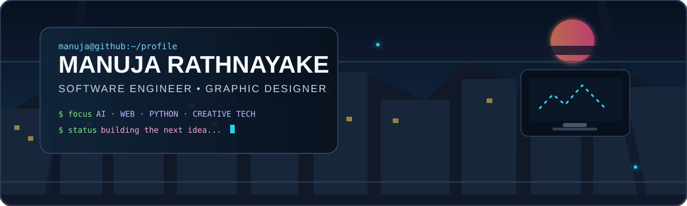
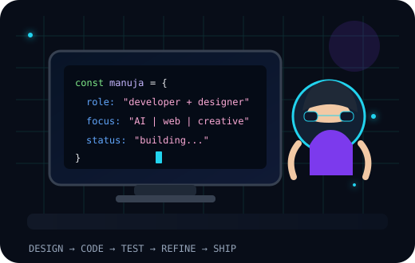
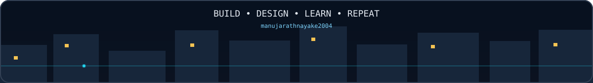

 
<h1>Manuja here 🔥 !</h1>

<h3>👋 Ayubowan! I'm Manuja Rathnayake</h3>

---

## 🌙 About Me

<table>
<tr>
<td width="58%" valign="top">

💻 I am a <strong>Software Engineering student</strong> who enjoys turning ideas into practical software.

🎨 I also work with <strong>Graphic Design and UI/UX</strong>, combining technical development with visual creativity.

🐍 My main interests include <strong>Python, Flask, web development, AI and machine learning</strong>.

🧠 I like learning by building real projects, testing ideas and improving them step by step.

🚀 My goal is to create software that is useful, clean, modern and enjoyable to use.

✨ When I'm not coding, I'm usually designing, experimenting with new tools or planning the next project.

</td>
<td width="42%" align="center" valign="middle">

</td>
</tr>
</table>

<strong>✨ Follow / Contact Me</strong>  

---

<h2>📚 Languages &amp; Tools I Have Placed My Hands On</h2>

  

---

<h2>⚡ 📊 GitHub Stats</h2>

 

 

  

---

<h2>💻 Tech Stack</h2>

---

<table>
<tr>
<td width="58%" valign="top">
<h3>🌟 Featured Work</h3>
<h4>🧠 Student Health Risk Prediction System</h4>

Machine-learning project combining model development, prediction workflows and a Flask web application.

  
<h4>🎨 Personal Portfolio</h4>

A showcase of my software-development and graphic-design work.

</td>
<td width="42%" valign="top" align="center">
<h3>💬 Dev Quote</h3>

<em>“Good software solves a problem. Great software makes the solution feel simple.”</em>

 
<code>DESIGN → BUILD → TEST → REFINE</code>
   

</td>
</tr>
</table>

---

<h2>🐍 Contribution Journey</h2>
<picture>
  <source media="(prefers-color-scheme: dark)" srcset="https://raw.githubusercontent.com/manujarathnayake2004/manujarathnayake2004/output/github-contribution-grid-snake-dark.svg" />
  <source media="(prefers-color-scheme: light)" srcset="https://raw.githubusercontent.com/manujarathnayake2004/manujarathnayake2004/output/github-contribution-grid-snake.svg" />
  
</picture>
  
<h3>🤝 Let's Build Something Great</h3>

  

 
⚡ Software Engineering × Graphic Design × AI — crafted by Manuja Rathnayake.

