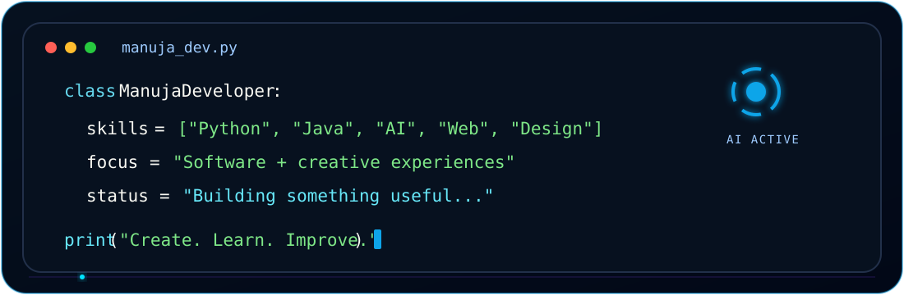

<div align="center">


<br/>


<br/>


&nbsp;


</div>

---

## 🧑‍💻 About Me

<div align="center">



</div>

- 🎓 B.Sc. Software Engineering undergraduate
- 🤖 Interested in Artificial Intelligence, Machine Learning and intelligent web systems
- 💻 Building projects with Python, Flask, Java, JavaScript, HTML, CSS and MySQL
- 📊 Interested in data analytics, predictive modelling and practical ML applications
- 🎨 Graphic Designer working with Figma, Photoshop, Illustrator and creative digital tools
- 🚀 Developing software and AI projects through practical university and personal work
- 📍 Based in Sri Lanka
- 📩 Reach me at [manujarathnayake2004@gmail.com](mailto:manujarathnayake2004@gmail.com)
- 🌐 Portfolio: [manujarathnayake2004.github.io/manujarathnayake](https://manujarathnayake2004.github.io/manujarathnayake/)

---

## 🛠️ Tech Stack

<div align="center">


</div>

---

## 📡 GitHub Signal

<div align="center">


<br/><br/>


</div>

---

## 🐍 Contribution Engine

<div align="center">

<picture>
  <source media="(prefers-color-scheme: dark)" srcset="https://raw.githubusercontent.com/manujarathnayake2004/manujarathnayake2004/output/github-contribution-grid-snake-dark.svg" />
  <source media="(prefers-color-scheme: light)" srcset="https://raw.githubusercontent.com/manujarathnayake2004/manujarathnayake2004/output/github-contribution-grid-snake.svg" />
  
</picture>

</div>

---

## 🎨 Creative + Technical Workflow

```text
IDEA  ──►  DESIGN  ──►  BUILD  ──►  TEST  ──►  REFINE  ──►  SHIP
  ▲                                                        │
  └────────────────────── LEARN & ITERATE ◄────────────────┘
```

- 💻 Building software projects and web applications
- 🎨 Creating graphics, interfaces and digital experiences
- 🧠 Exploring AI, machine learning and intelligent systems
- 🛠️ Improving practical development skills through real projects
- 🚀 Continuously learning modern tools and workflows

---

## 🌐 Connect With Me

<div align="center">

<a href="https://manujarathnayake2004.github.io/manujarathnayake/">
  
</a>
<a href="mailto:manujarathnayake2004@gmail.com">
  
</a>
<a href="https://github.com/manujarathnayake2004">
  
</a>

<br/><br/>

### `> create --learn --design --build --impact`

<sub>⚡ Crafted as a live GitHub profile experience — animations may adapt to your system theme.</sub>

</div>
